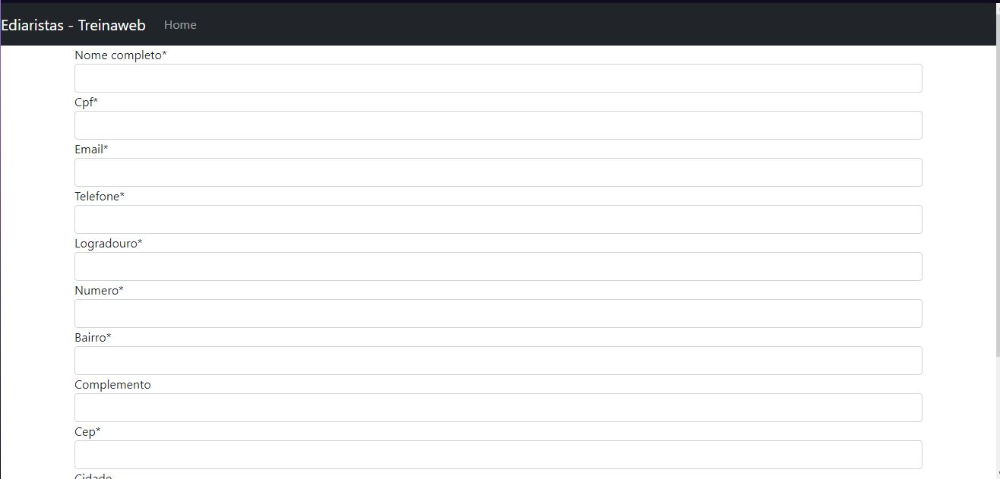
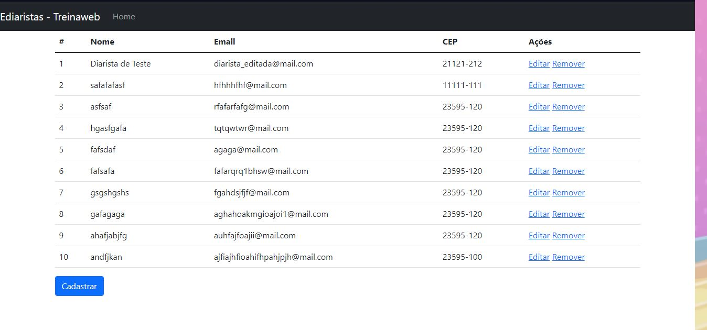
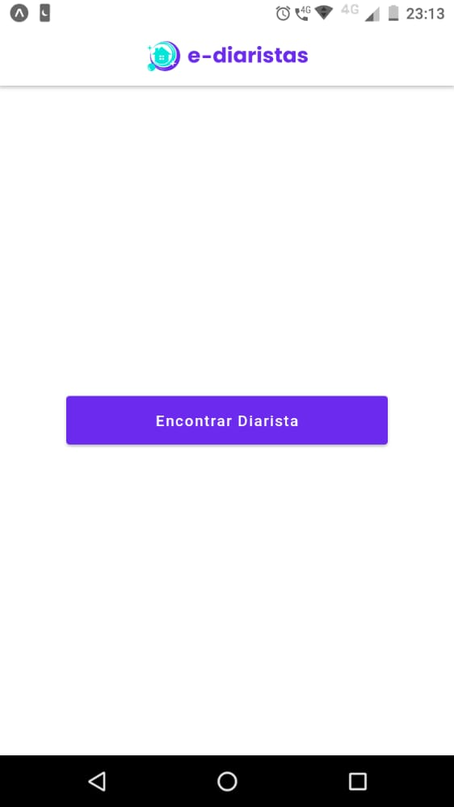

# TreinaWebMultiStack

## Project e-diaristas

💻 **_Front End_** 💻

> In the Front End stage, React was used with Next to style the site, where all the styling and layout of the project was defined using React hooks.

📷Print from the working site, you can access the project by downloading the zip and using the _npm run dev_ command to open localhost:3000📷:

🗃 **_Back End_** 🗃

> In the Back End step, the option was given to choose between PHP, Python and Java, using the frameworks, Laravel, Django and Spring. I chose Python/Django, it's the language I chose and I'm loving learning. With Django a CRUD was created where it was possible to register the day workers of the project, being able to edit or remove them. I learned how to create an API, which was used to join the Front End and Back End.

📷 Print of the running CRUD, can be executed from inside venv, in the path _\treinawebmultistack\ediaristas-backend\ediaristas_workshop_, once in the path, just run the command '_python manage.py runserver_ **will only work inside venv** which will open the *http://127.0.0.1:8000/web/cadastrar_diarista* 📷:
 

📲 **_Mobile_** 📲

> On mobile, React Native was used to make the application and Expo to visualize the development of the project.

📷 Print from the app running on the device. Just open the folder and run the command #expo start 📷:
 

🤩 **_Skills Obtained_**🤩

> I was able to learn a little about React, Next and React Native. Which gave me a better understanding of the Front End. And I was also able to learn more about Python with Django!
> All thanks to TreinaWeb!
